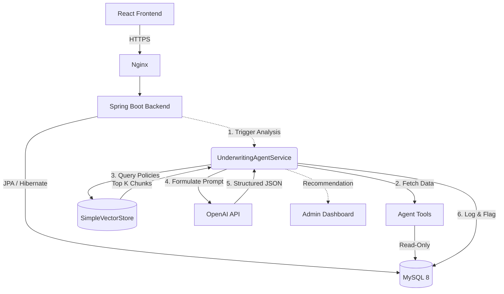

# FinServe — Digital Loan Origination & AI-Assisted Underwriting Platform

FinServe is a comprehensive, production-ready loan origination system featuring an **Agentic AI Underwriting Assistant**. Built with a robust Spring Boot backend and a dynamic React frontend, FinServe handles the entire loan lifecycle—from customer application and automated document verification to Retrieval-Augmented Generation (RAG) policy analysis and strict human-in-the-loop admin review.

### Tech Stack
| Layer | Technology |
|---|---|
| Frontend | React 19, Vite, React Router v7, Axios |
| Backend | Java 17, Spring Boot 3.2.x, Spring Data JPA, Hibernate, BCrypt |
| Database | MySQL 8 |
| AI | OpenAI `gpt-4o-mini` (completions), `text-embedding-3-small` (embeddings) |
| Rate Limiting | Bucket4j |
| Observability | Spring Boot Actuator, Micrometer Prometheus |
| Infra | AWS EC2, Nginx, systemd, Docker |
| CI/CD | GitHub Actions |

---

## Quick Start (Docker)

> **Prerequisites**: Docker Desktop, a `.env` file based on `.env.example`.

```bash
cp .env.example .env
# Fill in your DB password and optionally your OPENAI_API_KEY

docker-compose up --build
# Frontend: http://localhost:5173
# Backend API: http://localhost:8080
# Metrics: http://localhost:8080/actuator/health
```

Without an `OPENAI_API_KEY`, the AI runs in **mock mode** using deterministic hash-based embeddings — all flows work end-to-end for local development.

---

## 1. Overview

FinServe transforms traditional loan origination by introducing an AI underwriting agent. Unlike fully autonomous systems, the FinServe AI operates strictly as an *assistant*. It gathers financial context, verifies uploaded documents, queries a vector knowledge base of institutional policies, and presents a highly structured recommendation to a human underwriter. The final financial decision and state mutation are rigidly protected by backend Java business logic.

---

## 2. Architecture

FinServe is built on a reliable, traditional stack, enhanced with standalone AI components. It intentionally avoids heavy frameworks like Spring AI or external vector databases like Pinecone to remain lightweight and fast.



---

## 3. Loan Workflow

The lifecycle of an application ensures maximum compliance and auditability:

1. **Application**: Customer submits loan request (Amount, Tenure, Income, Expenses, EMI).
2. **Document Upload**: Customer uploads supporting files (e.g., Salary Slip).
3. **Automated Verification**: System extracts data and runs deterministic mismatch checks against declared income.
4. **AI Underwriting**: Admin triggers AI analysis. AI gathers data, fetches policy, and formulates a recommendation.
5. **Human Review**: Admin reviews the application, documents, verification diffs, and AI policy evidence.
6. **Final Decision**: Admin makes the final call. If contradicting the AI, a mandatory override reason is enforced.

---

## 4. Agent Tools

The AI operates in a controlled environment. The `AgentToolsService` provides the LLM with read-only structured context. It has access to:

- `getLoanApplication(applicationId)`: Fetches loan amount, tenure, and purpose.
- `getApplicantFinancialProfile(applicationId)`: Fetches declared income, expenses, and credit score.
- `getApplicantLoanHistory(applicationId)`: Retrieves past loan performance (e.g., existing loan counts, past defaults).
- `calculateDebtToIncomeRatio(applicationId)`: Dynamically calculates the applicant's DTI ratio based on proposed EMI + existing EMI.
- `getDocumentVerificationResults(applicationId)`: Retrieves flagged mismatches (e.g., Extracted Salary < Declared Salary).
- `getEligibilityRules()`: Fetches hardcoded backend constraints.

---

## 5. RAG & Policy Knowledge Base

FinServe includes a custom, standalone Retrieval-Augmented Generation (RAG) system:

- **Documents**: Fictional markdown policies (DTI limits, Income requirements, Credit score rules) live in `src/main/resources/policies/`.
- **Chunking**: On startup, `PolicyIngestionService` parses and splits these files by markdown headers.
- **Embeddings**: Fetches vectors using OpenAI's `text-embedding-3-small`. (Includes a deterministic hash-based mock fallback for offline local testing).
- **Vector Store**: A pure Java `SimpleVectorStore` that calculates Cosine Similarity in-memory.
- **Retrieval**: Before calling the LLM, the system generates a query from the applicant's profile, retrieves the Top 3 policy chunks, and injects them into the prompt.
- **Grounded Evidence**: The LLM is forced to output `policyReferences` (Document, Section, Relevance) mapping its decision directly to the provided text.

---

## 6. Security

- **Authentication**: Stateless endpoints. (JWT infrastructure ready).
- **Authorization**: Strict separation. Customers can only view/upload documents for their own loans. Endpoints like `PUT /status` and `POST /analyze` enforce `X-User-Role: ADMIN`.
- **AI Restrictions**: The AI **cannot** approve/reject loans or write to the database. It returns a `UnderwritingResult` which the orchestrator logs and uses to flag the application as `AI_RECOMMENDED` or `PENDING_HUMAN_REVIEW`.
- **Secret Management**: Passwords, Database URIs, and OpenAI API Keys are strictly loaded via environment variables (`.env`). Admin users are seeded dynamically via `AdminSeeder.java`.

---

## 7. Database Model

- **`User`**: Customers and Admins.
- **`LoanApplication`**: Core transactional record (amount, status, income).
- **`Document`**: File metadata and overall verification status.
- **`VerificationResult`**: Granular field-level checks (e.g., `field="monthlyIncome"`, `matchStatus="MISMATCH"`).
- **`UnderwritingResult`**: The immutable AI recommendation (Confidence, Risk Level, Verification Issues).
- **`AuditEvent`**: An immutable ledger tracking the chronological lifecycle (Submission -> Upload -> AI Analysis -> Admin Override).

---

## 8. Key API Endpoints

- `POST /api/loans`: Submit an application.
- `POST /api/documents/{loanId}/upload`: Multipart document upload and automated extraction trigger.
- `GET /api/documents/{loanId}`: View verification status (Admins see detailed field diffs).
- `POST /api/underwriting/{id}/analyze`: Trigger the Agentic AI (Rate-limited via Bucket4j).
- `PUT /api/loans/{id}/status`: Admin decision. Accepts an `AdminDecisionRequest` (Status, OverrideReason).
- `GET /api/loans/{id}/audit-events`: Fetches the immutable timeline.

---

## 9. Deployment

FinServe is designed to run locally via Docker, or deployed to AWS EC2 using native Linux services:

- **Docker**: Included `docker-compose.yml` spins up MySQL 8, the Spring Boot Backend (temurin-17), and the React Frontend (Nginx alpine).
- **AWS EC2 (t3.micro)**:
  - Backend runs as a `systemd` service (`finserve.service`).
  - Frontend is built statically and served via Nginx.
  - Nginx acts as a reverse proxy routing `/api` traffic to `localhost:8080`.
  - Credentials supplied via `/etc/finserve/.env`.

---

## 10. Testing

FinServe boasts a robust testing suite that covers the orchestrator, extraction pipelines, and RAG components.

- **Unit Tests**: Over 30 backend tests (Mockito/JUnit 5). Mockito interfaces were specifically extracted (`AgentToolsService`, `SimpleVectorStoreService`) to bypass `inline-mock-maker` limitations on Java 26.
- **Verification Tests**: Validates that mismatches between extracted document fields and declared fields properly flag the system.
- **AI Failure Tests**: Tests the `UnderwritingAgentService` graceful degradation. If the LLM times out, it asserts that the application falls back to `PENDING_HUMAN_REVIEW` without dropping the request.

---

## 11. AI Limitations & Disclaimers

> [!WARNING]
> **Advisory Only**: The AI in FinServe provides *recommendations*. It is structurally prevented from making final financial decisions or executing status changes on behalf of an underwriter.
> **Synthetic Data**: All policies, credit scores, and extraction logic inside this repository are purely synthetic/mocked for demonstration purposes.
> **Production Readiness**: While the code is productionized, real-world deployment of automated underwriting requires intense regulatory compliance (e.g., Fair Lending laws, explainability audits) beyond the scope of this repository.

---

## 12. Demo Flow

1. **Customer Applies**: A customer submits a loan for ₹500,000, claiming a monthly income of ₹100,000. Status -> `PENDING`.
2. **Customer Uploads Doc**: Customer uploads a `SALARY_SLIP`.
3. **Automated Verification**: The mock extraction service reads the document, finds `netIncome = ₹85,000`. The Verification Service flags a `MISMATCH`.
4. **Admin Triggers AI**: Admin clicks "AI Analyze". 
5. **AI Works**: The Orchestrator queries the vector store, retrieving the *Manual Review Policy* (which states document mismatches force a manual review). 
6. **AI Recommends**: The AI generates a recommendation: `REVIEW`, Risk Level `HIGH`, and cites the exact policy section. Status -> `PENDING_HUMAN_REVIEW`.
7. **Admin Decides**: The Admin reviews the AI's logic. If they decide to `APPROVE` the loan anyway (contradicting the AI), the frontend forces them to provide an Override Reason.
8. **Audit Trail**: The system successfully approves the loan, logging an `ADMIN_OVERRIDE` event noting the exact reason provided by the human underwriter.